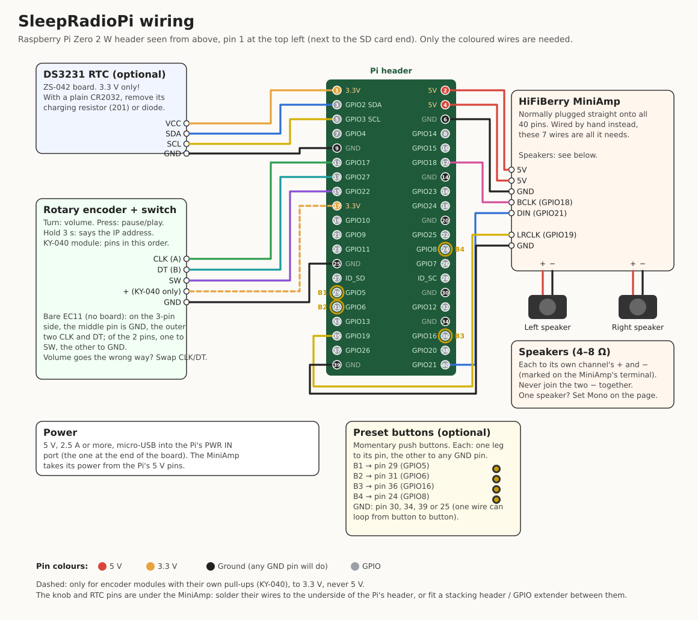
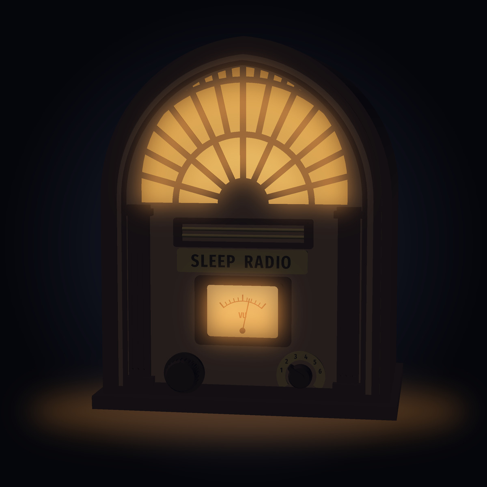

# SleepRadioPi-OS

**A bedside radio station in a box.** Plug it in and, about 40 seconds
later, a friendly DJ says good evening and starts playing *your* music
through its own speakers — back-announcing the song that just finished,
introducing the next, dropping in 70s-style patter, station idents and
jingles, the time, the news on the hour, and happy-birthday wishes for your
family. No phone, no app, no subscription and no screen: one knob for the
volume, and a web page for everything else. The presenter's voice is made on
the device (offline neural text-to-speech, even in your own cloned voice), so
it works with no internet at all.

It runs on a **Raspberry Pi Zero 2 W** with a **HiFiBerry MiniAmp** and two
small speakers in a 3D-printed art deco cabinet (in [`hardware/case/`](hardware/case/)).
This repo builds everything: a small, fast-booting, read-only Linux image
(Buildroot) that you can pull the plug on at any moment, with the radio
software, and the case to print.


## What it does

### On air

- **A real show, made from your music library.** A proper shuffle (no
  repeats within the last ~20 songs, the same artist spaced out), with the
  DJ talking between songs: *"That was Girl, by The Beatles. Coming up, Pink
  Moon, by Nick Drake."* How often it talks is up to you (before every song,
  or every 2, 3 or 5).
- **Time checks** worded for the exact moment they're spoken (twice as often
  in the morning), and a greeting for the time of day.
- **News** — BBC News bulletins at :00 (top stories) and :30 (softer
  stories), none in the night-time quiet hours.
- **Birthdays** — tell it whose birthday is when, and on the day the DJ
  wishes them a happy one between songs (*"happy forty-first birthday to
  Sarah"*), a few times through the day.
- **Artist radio and your own lists** — play only one artist (the DJ then
  says *"welcome to Beatles Radio"*) or a named list of artists (*"Friday
  List on Sleep Radio"*).
- **Play next** — search the library from your phone and queue songs; the
  DJ introduces them.
- **Internet radio** — when it's online, play a station instead of the show
  (the web page's Find tab): your saved stations, or search thousands in the
  [Radio Browser](https://www.radio-browser.info/) directory. What's playing
  shows on the page; same speakers, knob and sleep timer.
- **Noise to sleep to** — white, pink, brown, blue and more, played on top of
  whatever's on, with a balance control; the sleep timer fades the programme
  but leaves the noise playing. A preset button can switch it on and off.
- **Audiobooks** — mp3 folders or m4b files in their own folder, read with
  nothing from the DJ; each book remembers its place (a minute back after the
  sleep timer, for when you drifted off), with a whole-book progress bar and
  one-minute back / forward on the web page. At the end of a book the radio
  pauses instead of waking you with the show.
- **Album mode** — or pick a whole album: the DJ introduces it, then it plays
  start to finish like a record (no talk between tracks), and the DJ
  back-announces it at the end.
- **Jingles** from your own collection, shuffled, and a short one to open
  the show (on the main mix only, since they say "Sleep Radio").

### How it sounds

- **Every song at the same loudness.** Each track is measured once and
  turned up or down to a common level, with a soft limit so nothing clips.
- **No dead air.** Silence at the start and end of songs is trimmed, so the
  DJ comes in as the song ends.
- **A broadcast voice.** The presenter is EQ'd like a radio voice and
  levelled to sit with the music; every line is prepared while the previous
  song plays, so there's never a wait.
- **Tuned for small speakers.** A 3-band EQ with a low cut, stereo or mono,
  all done in software (the MiniAmp has no controls of its own); an optional
  bass-port back panel for the case.

### Using it

- **Power on and it plays.** About 10 seconds after you plug it in it chimes
  and the DJ says it's warming up, so you know it's alive; the show starts
  once the voice has loaded. (An LED flickers while it boots and pulses when
  it's on air.)
- **One knob.** Turn for volume; press to pause or play; **hold it for 3
  seconds** and the radio reads out its network address (handy away from
  home).
- **Four preset buttons** (optional), like a car radio's: each plays what
  it holds — Sleep Radio, an artist or list, an internet station, an album
  straight through — or does something: say the time, read the news now,
  a 30-minute sleep timer, say the address. Press the one that's playing to
  pause. **Hold one for 3 seconds** to keep what's playing on it (a beep, then
  "Button two: BBC Radio 4"). The same four are on the web page's front.
- **The web page** — http://sleepradiopi.local/ from any phone or computer
  on your network (optionally with a password) is its remote control.
  Everyday controls up front: now playing and skip, volume and a sleep timer
  that fades the speakers out, artist radio, play next (and, if you switch
  it on, listening in the browser too), and the four preset buttons, on a
  **Radio** tab drawn like the radio itself. **Find** searches everything at
  once: artists and lists, albums, songs and internet stations. Under
  **Settings**: the music
  library (add and delete music and jingles from the page), the
  speakers (stereo/mono, EQ, low cut), the DJ (voice, how often it talks,
  hooks, jingles, news, DJ and news speaking speeds), voices (download the standard one, upload your
  own), your artist lists, birthdays, test sounds for
  checking speakers and wiring, the password, a settings backup you can
  download and load back, and shut down.
- **Wi-Fi anywhere, quietly.** Add networks on the web page (Settings →
  Wi-Fi) as well as the one set up on the card; it joins whichever is in
  range. If the network drops (a router restarting, a weak signal in the
  night) it **keeps quietly reconnecting**, for as long as it takes, and never
  switches to its own network or says anything by itself, so nothing wakes
  you. Its own network — **SleepRadio-Setup**, password **sleepradio** —
  comes on when you ask (Settings → Wi-Fi → *Switch to the hotspot now*, e.g.
  before taking it somewhere new), or on a radio with no network set up: join
  it on your phone, open http://192.168.4.1 (phones usually offer to), and add
  your Wi-Fi.
- **Offline is normal.** Without the internet it keeps playing and talking;
  it only leaves out what needs the right time (time checks, news, birthday
  wishes) until the clock is known, from the internet or an optional
  real-time clock module.
- **Pull the plug any time.** The system and the music are read-only, logs
  live in RAM, and settings are written atomically, so a power cut can't
  corrupt anything.
- **Updates from the web page.** Settings → Updates checks for a new release
  on GitHub and installs it into a spare system slot while the music plays;
  the radio restarts, and the DJ says it's been updated. If a new version
  doesn't come on air within 5 minutes, the radio goes back to the old one
  by itself (and says so).

## Build one

You need a Raspberry Pi Zero 2 W, a HiFiBerry MiniAmp, one or two small
speakers (4–8 Ω), a rotary encoder with a push switch (a KY-040 module is
easiest), a 5 V 2.5 A micro-USB supply and a microSD card; a DS3231 clock
module and four 16 mm momentary push buttons (the presets) are optional. The case is in [`hardware/case/`](hardware/case/).



| From | To the Pi's header |
|---|---|
| MiniAmp | plugged onto all 40 pins (or wired: 5 V → 2 and 4, GND → 6 and 39, BCLK → 12, LRCLK → 35, DIN → 40) |
| Encoder CLK / DT / SW | pins 11 / 13 / 15 (GPIO17 / 27 / 22) |
| Encoder GND | pin 25 (any GND pin) |
| Encoder + (KY-040 only) | pin 17 (3.3 V — **never 5 V**) |
| RTC VCC / SDA / SCL / GND (optional) | pins 1 / 3 / 5 / 9 (3.3 V only) |
| Preset buttons 1 / 2 / 3 / 4 (optional) | pins 29 / 31 / 36 / 37 (GPIO5 / 6 / 16 / 26); each button's other leg to GND (pin 30, 34 or 39) |
| Speakers | the MiniAmp's terminal: left + and −, right + and − |

The knob and RTC pins are under the MiniAmp. Either solder their wires to
the underside of the Pi's header, or use a 1-to-2 GPIO splitter. This build
uses a GeeekPi 1-to-2 40-pin GPIO Edge Adapter Board, from Amazon: the MiniAmp
goes on one of its headers, and the knob and RTC wire to the other. A
stacking header between the Pi and the MiniAmp works too. Then [put the software on a card](#put-it-on-a-card).

**Testing the knob:** with the radio playing, turn the knob — the volume on
the web page moves with it (if it goes the wrong way, swap CLK and DT);
press and let go — it pauses, and again — it plays; hold it for 3 seconds —
it beeps and reads out its network address.

**Tuning the speakers:** on the radio's page, from a phone, Settings →
Speakers → **Tune speakers…**. The radio plays bursts of hiss, and the
[spectrum analyser](https://dylan7474.github.io/SleepRadioPi-OS/) opens and listens to them through the
phone's mic. It suggests the bass / mid / treble and low cut, and
**Apply on the radio** brings them back to the radio's page, ready to
**Apply**, with **Undo** to compare by ear (details in
[the app's README](app/README.md#tuning-the-speakers)).

## Put it on a card

You need a microSD card (16 GB or more, depending on your music) and, for
now, a **Linux PC** to add the music. Windows and Mac can flash the card, but
can't add the music yet.

1. **Download** `sdcard.img.xz` from the
   [latest release](https://github.com/dylan7474/SleepRadioPi-OS/releases/latest).
2. **Flash it** with [Raspberry Pi Imager](https://www.raspberrypi.com/software/):
   - Device: Raspberry Pi Zero 2 W.
   - OS: *Use custom*, then pick the downloaded `sdcard.img.xz`. You don't need
     to unpack it.
   - Storage: your card.
   - When it offers OS customisation, choose **No**. Those settings are for
     Raspberry Pi OS and don't apply here.

   [balenaEtcher](https://etcher.balena.io/) works just as well. On Linux you
   can also use
   `xz -dc sdcard.img.xz | sudo dd of=/dev/sdX bs=4M conv=fsync status=progress`.
3. **Add your music.** Run this on a Linux PC, with the card in the reader
   and not mounted; `/dev/sdX` is the card:

   ```sh
   git clone https://github.com/dylan7474/SleepRadioPi-OS
   cd SleepRadioPi-OS
   sudo scripts/provision-media.sh /dev/sdX --music ~/Music --stereo   # or --mono
   ```

   The first run adds a music partition that fills the rest of the card; run
   it again later to sync changes. Folders of albums are fine, and
   `--jingles <folder>` adds station jingles (mp3). Details are in
   [Building](#building).
4. **Optional, before you eject the card:** the boot partition (FAT, readable
   on any computer) can hold two files:
   - `wpa_supplicant.conf`: your Wi-Fi, so you can skip step 6. Copy
     [the example](board/sleepradiopi/wpa_supplicant.conf.example) and fill in
     your network's name and password.
   - `authorized_keys`: your ssh public key(s), one per line, if you want to
     log in (see [Using the Pi](#using-the-pi)).
5. **Put the card in the Pi and power on.** The first start takes a little
   longer.
6. **Connect it to your Wi-Fi.** With no network it knows, the radio makes its
   own after about a minute: **SleepRadio-Setup**, password **sleepradio**.
   Join it on your phone, open http://192.168.4.1 if the phone doesn't offer
   to, and add your Wi-Fi.
7. **The first time it's online**, it downloads the standard DJ voice (67 MB,
   a few minutes), and the show starts. Open **http://sleepradiopi.local** to
   control it, or hold the knob for 3 seconds and it reads out its address.

Later versions install from the web page (Settings → Updates), and your
music and settings stay put.

## The appliance image

- **Pull the plug at any time.** Boot, root (squashfs) and the media library
  are read-only; logs and runtime state live in RAM. The only thing written
  is a small data partition, and only by atomic replace.
- **Fast boot, more free RAM.** No desktop, no systemd, no services you don't
  need: BusyBox init, eudev, Wi-Fi, mDNS, ssh, and the station.
- **The radio software** is plain Python (sherpa-onnx for the voice, ffmpeg
  for audio, numpy for the EQ) in [`app/`](app/), with its own README (the
  settings, the web page's API, how it's put together) and tests.
  `package/sleepradiopi` installs it into the image from there.

## Building

Needs about 15 GB of disk space. The first build takes an hour or more; later
builds reuse `dl/` and ccache.

```sh
git clone --recurse-submodules <this repo>
cd SleepRadioPi-OS
cp board/sleepradiopi/wpa_supplicant.conf.example local/wpa_supplicant.conf
$EDITOR local/wpa_supplicant.conf     # your Wi-Fi network (optional)
cp ~/.ssh/id_ed25519.pub local/authorized_keys   # who can ssh in (optional)
make
```

The image is `output/images/sdcard.img`. With the card in the PC's reader:

```sh
sudo scripts/flash.sh /dev/mmcblk0          # new card: the whole image
sudo scripts/provision-media.sh /dev/mmcblk0 \
    --music ~/Music/SleepRadioMusic --voices ~/voices \
    --jingles ~/Music/SleepRadioJingles --mono    # or --stereo
```

`provision-media.sh` adds the media partition (filling the card) on its first
run and syncs the folders on later runs; it also writes a starter config to
`/data` that points at `/media`. `--voices` is a folder of voice packs, one
per subfolder (`stock/`, `personal/`: `model.onnx`, `tokens.txt`,
`espeak-ng-data/`). The 70s DJ hooks come with the app; `--hooks FILE` puts
your own list on `/media` instead. `--mono` (one speaker, or two playing the
same) or `--stereo` picks the model; a new config defaults to stereo.

After a rebuild, the same `flash.sh` command on a provisioned card rewrites
only boot and root, keeping `/data` and `/media`; `--full` wipes the card.

### Changing the radio software

The code is in `app/`. Run its tests on the PC (`cd app`, then as in
[`app/README.md`](app/README.md#running-it)), rebuild just the app into the
image, and update the Pi:

```sh
make sleepradiopi-dirclean && make && scripts/update.sh
```

### Releases, and updating from the web page

`scripts/release.sh 1.2.0 --notes "What's new."` builds the image with that
version in it and publishes a GitHub release (tag `v1.2.0`) with the system
image, `config.txt` and a `manifest.json` of sizes and SHA-256s (and the
kernel's). `--sdcard` also attaches the whole card image for new builds;
`--local` builds the files without tagging or publishing, to test an update
from a local web server (set `"update_source": "http://<PC>:8765/manifest.json"`
in the radio's config).

A radio updates itself from its page (Settings → Updates): the station asks
the root helper `update-watch` (`app/sleepradiopi/updater.py`), which
refuses a kernel change, streams the image into the spare root slot,
checks it against the SHA-256 (and reads it back from the card), updates
`config.txt` if needed, switches `cmdline.txt` and reboots. The station
confirms the update once music plays; if it hasn't within 5 minutes,
`S98update-watchdog` switches back to the old slot and reboots. Logs:
`grep update /var/log/messages`.

### Updating over Wi-Fi from the PC

```sh
make && scripts/update.sh
```

Writes the new root to the slot the Pi isn't running from (p2 or p3),
verifies it, updates `config.txt` if it changed, switches `cmdline.txt` to
it and reboots, then waits for the station (about 2 minutes). The previous root stays in the other slot. If the
Pi doesn't come back, put the card in the PC and set `root=` in
`cmdline.txt` on the boot partition back to the other slot. Kernel changes
can't be done this way (the kernel is on the shared boot partition): the
script refuses, and you use `flash.sh`.

### Going back to the previous version

The card holds two copies of the system, in partitions 2 and 3. The radio
runs one, and each update goes into the other, so the version you had before
is still on the card. If a new version doesn't come on air within 5 minutes,
the radio goes back by itself. To go back by choice, change which one it
boots. That's one word in `cmdline.txt` on the boot partition:

```
root=/dev/mmcblk0p3 rootfstype=squashfs ro rootwait ...
```

- **On a PC:** put the card in, open `cmdline.txt` on the boot partition (FAT,
  readable on any computer), change `mmcblk0p3` to `mmcblk0p2` or the other
  way round, and save. Keep it all on one line and change nothing else.
- **Over ssh:** `grep -o 'root=[^ ]*' /proc/cmdline` shows the running one.
  To go to the other one (here, from p3 to p2):

  ```sh
  mount -o remount,rw /boot
  sed -i 's#root=/dev/mmcblk0p3#root=/dev/mmcblk0p2#' /boot/cmdline.txt
  sync; mount -o remount,ro /boot; reboot
  ```

Good to know:

- **A new card has only one version.** Partition 3 stays empty until the first
  update, so there's nothing to go back to. Booting an empty slot just leaves
  the LED steady; set it back on a PC.
- **Only one earlier version is kept.** The next update overwrites the slot
  you're not running.
- **Settings, music and voices are shared** by both versions (they're on
  `/data` and `/media`), and so are the kernel and boot files (updates
  never change the kernel).
- After going back, Settings → Updates offers the newer version again.

`local/` is git-ignored. Its `wpa_supplicant.conf` and `authorized_keys` go
on the boot partition of the cards you build, but never into a release
(`scripts/release.sh` builds without them and checks). The system itself
holds no keys. Each radio makes its own ssh host key on its first boot, in
`/data/ssh`, and adds any `authorized_keys` from the boot partition to
`/data/ssh/authorized_keys` (`S49sshkeys`). After a new card, or on first
moving to 1.0.4, your ssh client will warn that the host key has changed:
`ssh-keygen -R sleepradiopi.local` clears it.

Other targets are passed through to Buildroot: `make menuconfig`,
`make savedefconfig`, `make linux-menuconfig`, `make <pkg>-rebuild`, ...

## Using the Pi

- `ssh root@sleepradiopi.local`: key only, and only with an
  `authorized_keys` file on the boot partition (one public key per line;
  it's added to `/data/ssh/authorized_keys` at the next boot). Without one,
  ssh stays closed.
- Green ACT LED: flickers while booting; a **heartbeat** while the station
  starts; **3 slow pulses** once it's playing, then dark. Wi-Fi isn't shown:
  offline is normal. A heartbeat that never ends means the station isn't
  starting (see the logs); a steady light means the kernel didn't start or
  mount the root.
- Wi-Fi: `wpa_supplicant.conf` on the boot partition (FAT, readable on
  any PC), plus any networks added on the web page (`/data/radio/wifi.json`,
  kept as WPA keys, not passwords). The manager (`sleepradiopi/wifi.py`,
  started by `S35wifi`, logs tagged `wifi`) joins a saved network and, without
  one, keeps reconnecting (`wpa_cli reassociate` every 30 s, backing off to
  2 min, and a full Wi-Fi restart every 10 min). The hotspot (hostapd +
  dnsmasq, 192.168.4.1) only runs when asked for, or with no network set up at
  all; if the manager can't run, `S35wifi` joins the card's network directly
  after 20 s.
- Serial console: GPIO14/15, 115200 baud (Bluetooth is disabled so the full
  UART is used).
- Logs: `/var/log/messages` (in RAM, lost at power-off).
- The station starts at boot as user `radio` and is restarted if it exits.
  Settings: `/data/radio/.config/sleepradiopi/config.json`; logs:
  `grep sleepradiopi /var/log/messages`; restart: `pkill -f sleepradiopi.main`;
  keep it off: `touch /data/radio/station.off`.
- It plays through the MiniAmp from power-up (`speaker_enabled`). The knob:
  turn for volume (remembered), press to pause; **hold it 3 s** and the radio
  beeps and reads out its IP address (or says it isn't connected), for
  finding the web page away from home.
- **The web page** (http://sleepradiopi.local/) is the control panel
  (the Radio, Find and Settings tabs):
  volume, stereo/mono, a 3-band EQ and low cut, a sleep timer that fades the
  speakers, the DJ (voice, how often it talks, hooks, jingles, news, speaking speeds), **play next** (search the library and queue songs; the DJ
  introduces them), artist radio ("Beatles Radio") and your own lists of
  artists ("Friday List"; the "Sleep Radio" jingles only play on the main mix), birthdays the DJ wishes on the day, test sounds (sweeps,
  pink noise, left/right (spoken) and phase checks), a virtual knob, skip, save/load
  settings and shut down (see *What it does*, above). Everything on it is a
  small JSON API too, e.g. `wget -qO- http://127.0.0.1/api/status` over
  ssh.
- **Web password** (optional, off by default): set it on the page under
  Settings → Password. Forgotten it? `sleepradio-password clear` on the Pi
  (or `scripts/web-password.sh clear` from the PC) opens the page again at
  once; `set` chooses a new one. The radio itself never needs it.
- **Shut down** from the web page (http://sleepradiopi.local/, bottom of
  the page): the station creates `/run/sleepradiopi/poweroff`, and
  `power-request-watch` (root, from inittab) runs `poweroff`, which saves the
  clock and unmounts `/data` as usual. Unplug after about 20 seconds; plug
  it back in to turn it on.
- Mono or stereo (`speaker_mono`; only the speaker, the web stream stays
  stereo): the **Speakers** buttons on the web page switch it at once and
  save it. `scripts/speaker-mode.sh mono|stereo` from the PC does the same
  but restarts the station; with no argument it shows the current mode.
- Speaker EQ (`speaker_eq`, bass / mid / treble, ±12 dB) and low cut
  (`speaker_highpass_hz`): the **Speaker EQ** card on the web page. The
  MiniAmp has no EQ, so the app does it in software; it's heard at once and
  saved on `/data`. With the case's bass port back panel, set the low cut
  to 140 Hz.
- **Save / Load settings** on the web page: a JSON copy of the settings and
  volume on your computer or phone, to load back after re-flashing the card
  or onto another radio (each radio keeps its own folders, port and pins).
  If a loaded setting needs it, the station restarts itself (init respawns
  it; `SLEEPRADIOPI_SUPERVISED=1` in `sleepradiopi-station` allows this).
- **Offline is normal.** The station only says the time and schedules news
  once the clock can be trusted (`/run/time-synced`): either NTP has set it
  since power-on, or an **RTC** answered at boot with a sensible time (its
  oscillator never stopped, and it's no earlier than the image build or the
  last saved time; `S12rtc`, logged as `rtc` in `/var/log/messages`). Until
  then it says no times, greets with "Hello" and skips news. Without an RTC
  the clock is still restored from `/data/clock` at boot, but that can be
  hours out. When Wi-Fi comes up, a udhcpc hook restarts ntpd so the clock
  is set within seconds, and every NTP update (on sync, then every 11
  minutes) is written to the RTC. To test offline:
  `touch /data/wifi-off-once; reboot` (Wi-Fi off for 5 minutes).
- **An update restarts the station, and it plays at start-up.** To update a
  paused radio without it starting to play: `POST /api/speaker
  {"volume": 0}`, wait 4 s (the volume is saved), run `update.sh`, then as
  soon as the page answers `{"pause": true}` and put the volume back.
- `media-rw` / `media-rw off`: make `/media` writable for a quick change over
  ssh (a card reader is much faster for anything big).

## Hardware and wiring

| Part | Notes |
|---|---|
| Raspberry Pi Zero 2 W | With a full 2×20 header soldered on. |
| HiFiBerry MiniAmp | 2 × 3 W class-D amp, a pHAT on the 40-pin header, powered from the Pi's 5 V. No volume control of its own: the radio does it in software. |
| Two speakers | 4–8 Ω; the case takes two 40 mm Gikfun EK1794. One speaker works too (set mono). |
| Rotary encoder with push switch | Volume, pause, and the long press. A bare encoder or a KY-040-style module. |
| DS3231 RTC module (optional) | Keeps the time with no network. |
| 40-pin GPIO splitter (optional) | Reaches the knob and RTC pins under the MiniAmp without soldering to the header. This build uses a GeeekPi 1-to-2 40-pin GPIO Edge Adapter Board (from Amazon; it fits the Zero 2 W too). |
| 5 V supply, 2.5 A or more | The amp draws from the Pi's 5 V. |

The wiring diagram is under [*Build one*](#build-one), above. (It's drawn by
`hardware/wiring/make_wiring.py`; keep it in step with
`board/sleepradiopi/config.txt` if a pin ever changes.)

The MiniAmp covers the pins the knob and RTC need, so either solder their
wires to the underside of the Pi's header, or use a GPIO splitter (see the
parts list) or a stacking header between the Pi and the amp.

| Use | GPIO | Header pin |
|---|---|---|
| MiniAmp I2S | 18, 19, 21 | 12, 35, 40 (+ 5 V on 2/4, GND 6) |
| Encoder A / B / switch | 17 / 27 / 22 | 11 / 13 / 15 (GND: any, e.g. 25) |
| RTC SDA / SCL | 2 / 3 | 3 / 5 (3.3 V on 1, GND 9) |
| Preset buttons 1–4 | 5 / 6 / 16 / 26 | 29 / 31 / 36 / 37 (GND: 30, 34 or 39) |

- The encoder pins have the Pi's internal pull-ups on, so a bare encoder
  works. A module with its own pull-ups (KY-040) has a `+` pin: put it on
  **3.3 V (pin 1 or 17), never 5 V**.
- Power the RTC from **3.3 V, never 5 V** (its I2C pull-ups go to its
  supply, and the Pi's pins are 3.3 V only). The common ZS-042 board charges
  its battery for a rechargeable LIR2032; with an ordinary CR2032, remove its
  charging resistor (often marked 201) or diode.
- Each speaker to its own channel's + and − on the MiniAmp; never join the
  two − terminals. A loose or reversed wire makes centred vocals vanish in
  stereo: the web page's test sounds (left/right, *Left, then right* and a phase check) find it.

`board/sleepradiopi/config.txt` sets the MiniAmp, encoder and switch
overlays (and the encoder pull-ups), the preset buttons (`gpio-key`, with
pull-ups, sending KEY_1–KEY_4; harmless with none fitted), and the RTC overlay
(`dtoverlay=i2c-rtc,ds3231`, which also turns I2C on; harmless with no RTC
fitted). A new RTC is set from NTP the first time the Pi is online. `update.sh` brings `config.txt` up to date on
the Pi, so none of this needs the card reader.

### Case

[`hardware/case/`](hardware/case/) is a 3D-printable stereo cabinet for this
build: two 40 mm speakers behind hex or art deco sunburst grilles (with
optional SLEEP RADIO lettering), the Pi, MiniAmp and RTC on the removable
back panel, and the encoder knob in the top. There's an optional **bass
port** back panel (~160 Hz) with a grommet for the cable slot; compare the
panels with the web page's test sounds. OpenSCAD source, ready STLs and
assembly notes are there (work in progress: the panels are printed and
fitted to a test ring; the full tube isn't printed yet).

## Card layout

| # | Partition | Size | Mounted | Holds |
|---|---|---|---|---|
| 1 | boot, FAT | 64 MB | `/boot` ro | firmware, kernel, `wpa_supplicant.conf` |
| 2 | rootA, squashfs | 256 MB | `/` ro | the system and the app |
| 3 | rootB | 256 MB | `/` ro when active | the other root slot: `update.sh` alternates between p2 and p3 |
| 5 | data, ext4 | 256 MB | `/data` rw | settings, caches, the random seed |
| 6 | media, ext4 | rest of the card | `/media` ro | music, voices, jingles |

Partitions 5 and 6 are in an extended partition (MBR: the Zero 2 W can't boot
from GPT). `S00data` checks `/data` with `e2fsck -p` and mounts it before
anything else starts.

## Layout

| Path | What |
|---|---|
| `app/` | The radio software (Python): the station, the DJ, the web page and API, and its tests |
| `buildroot/` | Buildroot 2026.02.x LTS, pinned as a submodule |
| `configs/sleepradiopi_zero2w_defconfig` | The image config |
| `board/sleepradiopi/` | Boot config, cmdline, genimage layout, build scripts |
| `board/sleepradiopi/rootfs-overlay/` | Files copied into the root filesystem |
| `board/sleepradiopi/linux.fragment` | Kernel options on top of `bcm2711_defconfig` (squashfs built in; unused drivers trimmed) |
| `package/` | `python-sherpa-onnx` (PyPI wheels) and `sleepradiopi` (installs `app/`) |
| `scripts/` | `flash.sh`, `provision-media.sh`, `update.sh`, `release.sh`, `speaker-mode.sh`, `web-password.sh` (run on the PC) |
| `app/sleepradiopi/web/analyser/` | The spectrum analyser web page that suggests speaker settings (published to GitHub Pages, and served by the radio at `/analyser/`) |
| `hardware/case/` | The 3D-printed case (OpenSCAD source, STLs, assembly notes) |
| `hardware/wiring/` | The wiring diagram (`wiring.svg`) and the script that draws it |

## Roadmap

What's left to do (everything else described here is built and running):

- **Wire the knob and the RTC** — check the knob's direction, step and long
  press on the real switch, and the RTC keeping time with no network.
- **Library tools** — adding and deleting music is on the web page (Settings
  → Media library); still to do: syncing a whole desktop library in one go.
- **A needle VU meter** — a physical meter driven from a PWM pin, with the
  Android app's ballistics; one meter first.
- **Music from any computer** — adding music needs a Linux PC today
  (`provision-media.sh`). The radio could make its music partition itself on
  first boot and take music uploaded from the web page, so that Windows and
  Mac users can do it too.
- **A laser-cut wood cathedral** — a real-wood version of the cathedral case:
  - the face and fretwork cut from walnut-veneered plywood, the sides and
    back from plywood or MDF;
  - the arch kerf-bent (cut so the plywood bends) or built from stacked
    profiles;
  - printed parts where that's easier (knob, meter bezel, speaker ring,
    brackets);
  - the flat parts exported as DXF/SVG for the laser from the same OpenSCAD
    design.
- **A family bulletin** — reassuring messages the DJ reads at set times:
  - for someone with poor memory, for example in a care home;
  - for example "You're at Rosewood House, the staff are looking after you.
    Dylan lives five minutes away and will be in to see you soon";
  - it opens with the day and date;
  - messages are written on the web page, and can end on a set date
    (for "coming on Sunday");
  - none at night;
  - read in the DJ's voice as "a message from ...", or optionally a
    recorded clip;
  - updated from home, through a private link the radio checks or through
    remote access, since a care home's Wi-Fi usually blocks incoming
    connections.
- **A glow behind the grilles** — warm-white LEDs (a 5 V COB strip)
  lighting the grille from behind, for a soft glow at night: dimmable from the
  page, fading with the sleep timer, shared with the VU meter's backlight. On
  the box it glows round each speaker (a clip-in holder inside the collar,
  wired with the speakers). On the cathedral it's behind the grille cloth, so
  the sunburst shows in silhouette:

  
- **A cathedral radio case** — a 1930s art deco cathedral set in wood, with
  one 4-inch speaker and the VU meter as its dial. The design, the pictures and
  what to buy are on [its page](hardware/cathedral/README.md); the parts come
  once the speaker and meter are here to measure.
- **Auto-tune with a USB mic** — a cheap USB mic in the Zero's data port,
  where you sit, and an **Auto-tune** button on the radio's page:
  - it plays the pink noise, records the box and works out the EQ and low
    cut with the analyser's maths (and `audio/eq.py`);
  - it applies them, measures again, and goes back to the old settings if
    they didn't help;
  - no phone or laptop needed; re-run it after changing the back panel or
    moving the radio (a new cathedral box especially);
  - needs USB audio in the trimmed kernel.
- **A carry strap** — designed, still to print and fit: a leather strap
  through two printed side loops, with a drill guide for a case that's already
  printed (see [the case README](hardware/case/README.md#carry-strap)).

## Licence

Build scripts, configs and the case design: GPL-2.0-or-later, the same as Buildroot. The radio
software in `app/` is GPL-3.0-or-later (`app/LICENSE`; its offline voice engine links eSpeak-NG,
which is GPL). The standard voice, downloaded by the radio when it has none, is Piper's
"southern_english_female" (low) via sherpa-onnx; its training data is OpenSLR 83, CC BY-SA 4.0. The image
contains many packages under their own licences; `make legal-info` lists them.
