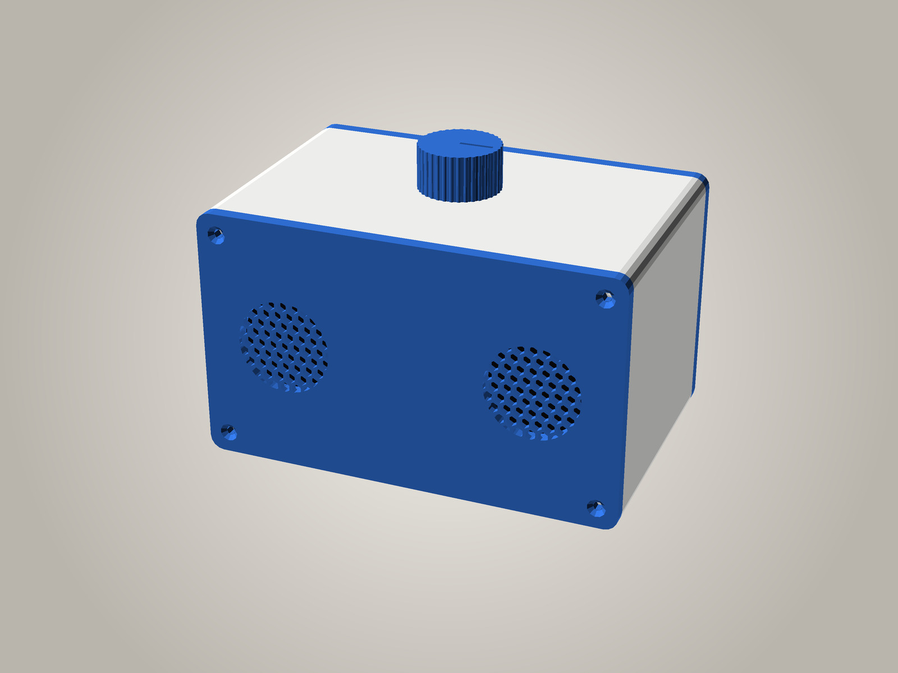

# SleepRadioPi box

> **Work in progress.** The front and back panels have been printed and fitted;
> the full tube hasn't been printed yet, and the speaker sizes below are still
> unverified. Print `stl/tube_ring.stl` first to check the fit.

A 3D-printable stereo radio cabinet for SleepRadioPi-OS: two **Gikfun EK1794 40 mm 4 Ω 3 W** speakers behind hex
grilles, the **Pi Zero 2 W + HiFiBerry MiniAmp** and the **ZS-042 DS3231 RTC** on the back panel, and an
**EC11 rotary encoder** in the middle of the top. No display.

Outer size 152 x 100 x 91 mm (w x d x h), about 1.1 L inside (sealed box, which helps the small speakers' bass).

| File | Print | Notes |
|---|---|---|
| `stl/tube.stl` | stands on its front end, 152 x 91 footprint, 90 mm tall | top, bottom and sides in one piece; no supports |
| `stl/tube_ring.stl` | stands on an end, 152 x 91 footprint, 20 mm tall | **fit-test ring**: a 20 mm slice of the tube with the same walls, corner bosses and knob hole. Screw both panels to it (M3 x 12 still fit) and fit the encoder before printing the full tube (~1/4.5 of its print time) |
| `stl/front_plate.stl` | face down | front panel + knob + 7 clamp tabs, pre-arranged |
| `stl/front_plate_noknob.stl` | face down | the same plate **without the knob**, for printing the knob in another colour (`part="front_plate_noknob"`) |
| `stl/front_logo.stl`, `stl/front_plate_logo.stl` | face down | front panel with **SLEEP RADIO** engraved between the speakers (alone, and as a plate with the knob + tabs); see *Lettering* below |
| `stl/rear.stl` | outside face down | back panel with the Pi posts and RTC rim |
| `stl/front.stl`, `knob.stl`, `tabs.stl` | | the same parts, separately |
| `knob.scad` → `stl/knob.stl` | top face down, no supports | **standalone knob** (e.g. to print in another colour); same knob as `part="knob"` -- keep the two in step. `openscad --backend=manifold -o stl/knob.stl knob.scad` |
| `sleepradiopi_box.scad` | | parametric source: all sizes at the top |
| `mockup.scad`, `make-mockup.sh` → `mockup.jpg` | | the picture above (see the end) |

PLA or PETG, 0.2 mm layers, 3 perimeters, 15–20 % infill, no supports. Everything fits the MK2.5 bed.

## Draft panels (fit test)

Not included as STLs; render them with e.g. `openscad --backend=manifold -D draft=true -D 'part="draft_plate"' -o draft_plate.stl sleepradiopi_box.scad`.
`-D draft=true` makes the panels 1.2 mm thick, swaps each grille for a plain opening and drops the countersinks.
Everything that affects fit stays exactly where it is: the speaker collars and clamp bosses, the Pi posts,
the RTC rim, the cable slot, the corner screw holes and the locating lips. The clamp-tab pilot holes go right
through the thin plate (7.2 mm deep with the boss, so an M2.5 x 6 or x 8 screw stays inside). Only the panels have a draft
version; never render the tube with `draft=true`.

## Lettering

`-D front_logo=true` engraves the words in `logo_lines` (default SLEEP / RADIO)
0.8 mm into the front face, centred between the grilles, every line stretched to
`logo_w` (36 mm). Engraved rather than raised because the front prints face
down: raised letters would put the whole panel on supports. The font is
Liberation Sans Bold; OpenSCAD substitutes another font if it isn't installed.

In one filament the letters are a subtle recess. To make them stand out:

- **Paint or wax fill:** wipe acrylic paint or rub-n-buff over the letters and
  wipe the face clean.
- **Filament change (single-colour printer):** change filament at the start of
  the layer at 0.8 mm (layer 5 at 0.2 mm). The letters show the new colour at the
  bottom of each recess, but so do the panel's edges and the insides of the
  grille holes above 0.8 mm.
- **Multi-colour printer:** would need the letters as a separate inlay body
  to colour in the slicer; not provided yet.

- 4x M3 x 12 countersunk self-tapping screws per panel (8 in total), into the corner bosses of the tube.
- 4x M2.5 x 6 screws + 4x 12 mm M2.5 standoffs (the pHAT kit), for the Pi and the amp.
- Speakers: hot glue, **or** 6x M2.5 self-tappers with the printed clamp tabs: x 8 grips best (6 mm into the boss);
  x 6 works (4 mm).
- Stick-on rubber feet; foam tape for the RTC.

## Assembly

1. **Speakers:** each drops face down into the collar behind its grille. Either run a bead of hot glue around the
   rim, or screw on the three clamp tabs. Each tab sits on a 6 mm boss and has a foot under its nose that presses on the
   rim (the tabs print plate-down, foot-up, no supports); swing a tab aside round its screw while the speaker goes in. Turn the
   speaker so its solder tabs sit in a gap between the clamps.
2. **Pi:** screw the M2.5 x 6 screws in **from the outside of the back panel** (the heads sit down in the deep
   counterbores), through the posts and the Pi, into the 12 mm standoffs. Fit the MiniAmp on the header and screw
   it to the standoffs. The posts leave 7 mm under the Pi for header stubs and encoder wires soldered underneath.
   With the panel off, there's 58 mm free on the port side and 17 mm on the GPIO side (to the RTC), and 10 mm at
   each end inside the box.
3. **Power:** thread the micro-USB plug in through the slot in the back panel, plug it in, and zip-tie the cable
   through the two small slots beside it for strain relief.
4. **Encoder:** from inside the tube, push it up through the top hole and fit the nut on top. The inside of the wall is
   thinned to 2 mm around the hole so the nut gets enough thread. The hole is round, 7.6 mm (0.2 mm over, since it prints sideways). Push the knob on.
5. Wire the speakers to the amp terminal (leave enough slack to lay the back panel down next to the box), then
   screw the front and back panels onto the tube. Each panel has a lip that locates it inside the tube.

The back panel comes off with all the electronics on it, so you don't need to reach inside the box.

## Checks done

`part="check"` and `part="check_pull"` render as empty or zero-volume: the tube, panels, speakers, Pi stack
(including the USB plug and its bend), encoder, RTC and clamp tabs don't overlap, and the back panel with the Pi
on it slides straight out past the encoder.

## To measure (unverified)

Gikfun's listing only gives the 40 mm diameter. Check with calipers and change the values at the top of the
`.scad` file:

- `spk_d = 40`: rim diameter (the collar is 0.6 mm bigger).
- `spk_rim_t = 2`: thickness of the flat front rim. The collar is 0.4 mm lower than this, and the tab feet are sized
  (`clamp_boss_h` 6 mm minus the collar height) so they press 0.4 mm into the rim.
- `spk_depth = 22`: front of the speaker to the back of the magnet (plenty of room either way).
- The width of the flat rim: the clamp tabs reach 2 mm in over it.

## Mock-up picture

`mockup.jpg` is a coloured picture of the finished radio. `mockup.scad` sets the
colours (`body_colour`, `panel_colour`, `knob_colour`) and reuses the real parts
unchanged; `./make-mockup.sh` renders it and places it on a studio backdrop
(needs OpenSCAD + ImageMagick, ~30 s). Change the view with
`CAM=tx,ty,tz,rx,ry,rz,dist ./make-mockup.sh`.

## Licence

GPL-2.0-or-later, the same as the rest of this repo.
