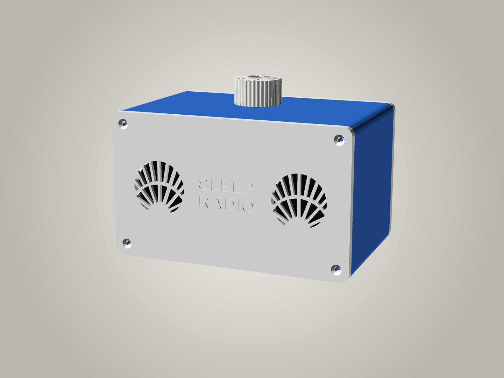
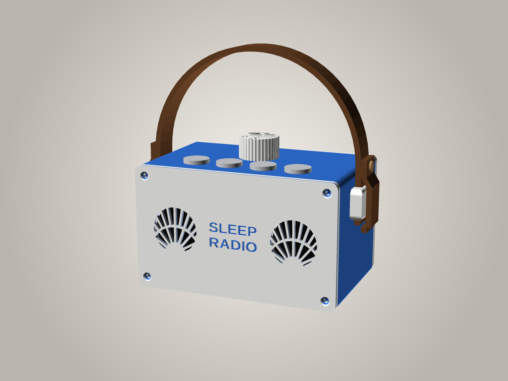

# SleepRadioPi box

> **Work in progress.** The front and back panels have been printed and fitted;
> the full tube hasn't been printed yet, and the speaker sizes below are still
> unverified. Print `stl/tube_ring.stl` first to check the fit.

A 3D-printable stereo radio cabinet for SleepRadioPi-OS: two **Gikfun EK1794 40 mm 4 Ω 3 W** speakers behind hex
grilles, the **Pi Zero 2 W + HiFiBerry MiniAmp** and the **ZS-042 DS3231 RTC** on the back panel, and an
**EC11 rotary encoder** in the middle of the top. No display.

Outer size 152 x 100 x 91 mm (w x d x h), about 1.1 L inside (~0.95 L net). Not quite sealed: the power cable
slot in the back is a small vent. An optional **bass port** back panel is below.

| File | Print | Notes |
|---|---|---|
| `stl/tube.stl` | stands on its front end, 152 x 91 footprint, 90 mm tall | top, bottom and sides in one piece; no supports |
| `stl/tube_ring.stl` | stands on an end, 152 x 91 footprint, 20 mm tall | **fit-test ring**: a 20 mm slice of the tube with the same walls, corner bosses and knob hole. Screw both panels to it (M3 x 12 still fit) and fit the encoder before printing the full tube (~1/4.5 of its print time) |
| `stl/front_plate.stl` | face down | front panel + knob + 7 clamp tabs, pre-arranged |
| `stl/front_plate_noknob.stl` | face down | the same plate **without the knob**, for printing the knob in another colour (`part="front_plate_noknob"`) |
| `stl/front_logo.stl`, `stl/front_plate_logo.stl` | face down | front panel with **SLEEP RADIO** engraved between the speakers (alone, and as a plate with the knob + tabs); see *Lettering* below |
| `stl/front_logo_sunburst.stl`, `stl/front_plate_logo_sunburst.stl` | face down | the lettered front with **art deco sunburst** grilles instead of hex (`-D 'grille_style="sunburst"'`); the plate adds the **sunburst knob** and the 7 tabs, the complete matching set; see *Sunburst grilles* below |
| `twotone/front_white_face_blue_letters.3mf` | face down (PrusaSlicer project) | the lettered sunburst front in **two colours**: white face, **blue letters** (two filament changes built in); see *Two-tone front* below |
| `twotone/front_blue_face_white_letters.3mf` | face down (PrusaSlicer project) | the same front with a **blue face and white letters** (one filament change) |
| `twotone/test_white_face_blue_letters.3mf`, `twotone/test_blue_face_white_letters.3mf` | face down (PrusaSlicer projects) | **try these first**: a 50 × 16 mm tile with "SLEEP" at the front's size and depth and the same filament changes, ~9 minutes (`twotone_test.scad` → `stl/twotone_test.stl`) |
| `stl/rear.stl` | outside face down | back panel with the Pi posts and RTC rim |
| `stl/rear_port.stl` | outside face down, no supports | the same back panel with a **bass port** (`-D rear_port=true`); see *Bass port* below |
| `stl/grommet.stl` | flange down | closes the power cable slot round the cable; use it with the bass port |
| `stl/strap_loops.stl` | bar down, no supports | two **carry strap loops**, screwed to the sides from inside; see *Carry strap* below |
| `stl/strap_guide.stl` | side down, no supports | a **drill guide** for the loops' screw holes in a tube printed without them |
| `stl/top_test.stl` | outside face down, no supports | just the **top wall** with the preset buttons' and knob's holes (~40 min), to try the buttons before printing the tube; see *Preset buttons* below |
| `stl/tube_buttons.stl` | as the tube | the tube **with the four 16 mm preset buttons' holes and the knob moved back** (`-D buttons=true`) |
| `stl/tube_buttons_handle.stl` | as the tube | the same **plus the carry strap loops' screw holes** (`-D buttons=true -D handle=true`) |
| `stl/tube_handle.stl` | as the tube | the tube **with the loops' screw holes** (`-D handle=true`), for a new print |
| `stl/front.stl`, `knob.stl`, `tabs.stl` | | the same parts, separately |
| `stl/knob_sunburst.stl` | top face down, no supports | the knob with the grilles' **sunburst fan** engraved 0.8 mm into its top instead of the pointer groove; the fan rises towards where the groove pointed, so it still shows the knob's position (`knob_style="sunburst"` in either `.scad`) |
| `knob.scad` → `stl/knob.stl` | top face down, no supports | **standalone knob** (e.g. to print in another colour); same knob as `part="knob"` -- keep the two in step. `openscad --backend=manifold -o stl/knob.stl knob.scad` |
| `sleepradiopi_box.scad` | | parametric source: all sizes at the top |
| `mockup.scad`, `make-mockup.sh` → `mockup*.jpg` | | the pictures in this README (see the end) |

PLA or PETG, 0.2 mm layers, 3 perimeters, 15–20 % infill, no supports. Everything fits the MK2.5 bed.

## Draft panels (fit test)

Not included as STLs; render them with e.g. `openscad --backend=manifold -D draft=true -D 'part="draft_plate"' -o draft_plate.stl sleepradiopi_box.scad`.
`-D draft=true` makes the panels 1.2 mm thick, swaps each grille for a plain opening and drops the countersinks.
Everything that affects fit stays exactly where it is: the speaker collars and clamp bosses, the Pi posts,
the RTC rim, the cable slot, the corner screw holes and the locating lips. The clamp-tab pilot holes go right
through the thin plate (7.2 mm deep with the boss, so an M2.5 x 6 or x 8 screw stays inside). Only the panels have a draft
version; never render the tube with `draft=true`.

## Lettering

`-D front_logo=true` engraves the words in `logo_lines` (default SLEEP / RADIO)
0.8 mm into the front face, centred between the grilles, every line stretched to
`logo_w` (36 mm). Engraved rather than raised because the front prints face
down: raised letters would put the whole panel on supports. The font is
Liberation Sans Bold; OpenSCAD substitutes another font if it isn't installed.

In one filament the letters are a subtle recess. To make them stand out:

- **Paint or wax fill:** wipe acrylic paint or rub-n-buff over the letters and
  wipe the face clean.
- **Filament change (single-colour printer):** change filament at the start of
  the layer at 0.8 mm (layer 5 at 0.2 mm). The letters show the new colour at the
  bottom of each recess, but so do the panel's edges and the insides of the
  grille holes above 0.8 mm.
- **Multi-colour printer:** would need the letters as a separate inlay body
  to colour in the slicer; not provided yet.

## Sunburst grilles

`-D 'grille_style="sunburst"'` swaps the hex holes for a 1930s art deco fan:
nine rays rise from a half-sun at the bottom of each grille, an arc crosses
them 20 mm out, and above the arc an extra ray runs between each pair so the
top slots stay narrow (`sun_*` settings). Ribs are 1.6 mm wide; the slots are
about 1.2 mm near the half-sun and 4.3 mm at the top.

The picture at the top shows it with the lettering.

## Bass port

`-D rear_port=true` adds a 20 mm port low down on the back panel, on the side away from the RTC: a tube 22 mm
long overall (the 5 mm panel + 17 mm inside), flared 45 degrees at both ends so it prints without supports and
doesn't whistle. With ~0.95 L inside it tunes the box to about **160 Hz** (OpenSCAD echoes the estimate). It's
clear of the Pi, the USB plug, the RTC and the speakers (`part="check"` is unchanged).

What to expect: a little more **warmth, roughly 150-250 Hz**; 40 mm speakers can't do deep bass in any box.
Gikfun don't publish the speakers' Thiele-Small figures, so the tuning is a sound estimate; the back panel is a
separate part, so going back is just swapping panels.

With the port:

- **Close the cable slot** with `stl/grommet.stl`. On its own the slot is a vent tuned ~160 Hz too; two vents
  together push the tuning up and make it unpredictable. Thread the USB plug through the slot, open the grommet's
  slit, clip it round the cable and press it in from outside. `grommet_cable_d` (4 mm) is a guess: measure your
  cable. `grommet_clr` sets the fit in the slot.
- **Set the radio's low cut to 140 Hz** (the web page's *Speaker EQ* card). Below the port's note a ported box
  stops holding the cones back, and a bass boost there only makes them flap and distort.
- Keep the back of the radio **about 5 cm from the wall**, so the port can breathe.

To compare the panels, use the **Test sound** card on the radio's web page: the bass sweep (40-600 Hz, the
frequency shown as it plays) by ear, or pink noise with the [spectrum analyser](https://dylan7474.github.io/SleepRadioPi-OS/) (or a phone app) held in the same place for
each panel; the analyser also suggests the EQ and low cut for the panel you keep. Tests bypass the EQ and low cut, so they hear the box itself; keep the volume the same for both.

Change `port_len` to retune: longer is lower (a 20 mm port 27 mm long is ~150 Hz; 17 mm long, ~170 Hz). Don't go
much below 150 Hz.

## Two-tone front

The lettered front prints face down with SLEEP RADIO cut 0.8 mm into the
face, so the first 0.8 mm printed *is* the face, with letter-shaped holes,
and whatever colour comes next shows at the bottom of the letters. One or two
filament changes at the right layers make a two-colour front on a
single-extruder printer:

- **`twotone/front_white_face_blue_letters.3mf`** — load **white**; the
  printer changes to **blue** after the face (0.8 mm, 4 layers), and back to
  **white** after 4 more layers (1.6 mm). A white face with blue letters (as
  in the picture). The letters' 4 blue layers keep them bold (one layer looked
  washed out); the 0.8 mm blue layer also shows as a line round the panel's
  edge and in the grille slots.
- **`twotone/front_blue_face_white_letters.3mf`** — load **blue**; one change
  after the face to **white**. A blue face with white letters, and a 0.8 mm
  blue band at the front edge.

**Try it first:** `twotone/test_white_face_blue_letters.3mf` (or
`test_blue_face_white_letters.3mf`) prints a small 2.4 mm tile with "SLEEP" at
the real size and depth and the same changes in about 12 minutes, so you can
check the swaps and how the letters come out before the 3½-hour front.

They're PrusaSlicer projects (an STL can't hold a colour change) with
PrusaSlicer's own presets: Original Prusa i3 MK2.5, **0.20mm NORMAL @MK2.5**
(so the face is exactly 4 layers — keep 0.2 mm layers, or the changes miss
it) and Sunlu PLA; about 3½ hours. Open one, check it's on your printer,
slice, and print. At each change (M600) the printer unloads, beeps for the new
filament, loads it and asks on the LCD whether the colour is clear — answer
**No** to purge more until it's the clean new colour, or the first layers come
out paler. `python3 make-twotone.py` rebuilds them (from
`stl/front_logo_sunburst.stl` and `stl/twotone_test.stl`) and slices each one
to check every change comes at the start of the right layer.

## Carry strap

A leather strap over the top, fixed through a printed loop on each side,
1930s portable style. The loops sit centred front to back (the balance point),
11 mm below the top, clear of the corner bosses inside. Each stands out 8.5 mm
from the side. The strap runs in a channel between the side wall and the loop's
bar.

**You need:**

- **A leather strap, 20 mm wide and up to 4 mm thick, about 430 mm long**
  (buy longer and cut to fit). That's about 280 mm for an arch 80 mm above the
  top (room for your hand over the knob), plus about 75 mm at each end to go
  through the loop and fold back. For another size of
  strap, change `strap_w` and `strap_t` at the top of the `.scad` and render the loops again.
- **2 Chicago screws** (5 mm, for 8–10 mm of leather) or rivets, and a leather
  hole punch.
- **4 M3 x 10 self-tapping screws with pan or cheese heads** (not countersunk),
  and small washers.

**The holes:**

- **New tube:** print `stl/tube_handle.stl`. It's the normal tube with the
  four 3.4 mm holes already in the sides.
- **Tube already printed:** use `stl/strap_guide.stl`. With both panels on,
  clip it over a top corner of the box, between the front and back faces, and
  drill a 3.5 mm hole through each of its two holes. For the other side, turn
  it round end to end. Then take the back panel off and blow out the swarf.

**Fitting:**

1. Take the back panel off (the electronics come with it). Hold a loop on the
   outside, bar outwards and the channel against the wall. From inside, screw
   in the two M3 x 10 screws, with washers, through the wall into the loop's
   pilot holes. Snug them up, but don't overtighten: they grip the plastic.
2. Push each end of the strap down through a loop, behind the bar. Fold it
   up over the bar, and lay it back on the strap above the loop. Punch through
   both layers about 13 mm above the loop, and fit a Chicago screw.
3. Put the back panel back on.

The whole radio weighs about half a kilogram. Each loop's two screws take the
load sideways, and the bar prints flat, so the load is along its layers, not
across them.

## Preset buttons

Four chunky **16 mm** stainless momentary push buttons (flat head, screw
terminals: no soldering) in a row across the top, near the front, **1 2 3 4**
from left to right, with the knob on its own behind them. The channels and
the volume are in separate places, which is easier to follow (this radio is
for an elderly listener). With `-D buttons=true` the knob moves 12 mm back
(`btn_knob_back`, still clear of the Pi stack) to make room. The row is 25 mm
back from the front face, with 26 mm between buttons, leaving ~12 mm of top
between the buttons' heads and the knob. It clears the front panel's lip and
the speakers' top clamp tabs and their screws (the outer buttons sit inboard
of them); the checks allow for 30 mm of switch body and terminals below the
top. Wiring and what they do: the main [README](../../README.md#build-one).

**You need:** 4 momentary (not latching, "self-locking") panel push buttons
with a **16 mm** threaded body and a nut, for a panel up to 3 mm thick (the
top wall), e.g. Gebildet's 16 mm flat-head ones with 2 screw terminals. The
sizes marked CHECK at the top of the `.scad` (the hole, head, nut and body
length) are typical values: measure yours and change them if they differ.

**Try them first:** `stl/top_test.stl` is just the top wall of that tube,
3 mm thick with the four button holes and the knob's hole, printed flat and
outside face down (~40 min, and flat-printed holes come out rounder). Screw
the buttons and the encoder in and check the fit, the nuts and how the row
feels before the ~5-hour tube.

**The tube:** `stl/tube_buttons.stl` (`-D buttons=true`), the tube with the
four holes and the knob moved back. The holes print sideways (the tube stands
on its front end), so their tops are **teardrops cut flat** 8.75 mm from the
centre, just inside the button's 19 mm head (`btn_teardrop`): no overhang to
curl up and catch the nozzle, and hidden once the buttons are in.

A 5-hour print that shifts partway (everything above a point offset a
little) is usually the bed skipping steps, most often because the nozzle
clipped a curled-up edge on a travel move. Turn on **Lift Z** (PrusaSlicer:
Printer Settings → Extruder → Retraction, 0.4 mm) for the tube, and check
the Y belt's tension, the Y pulley's grub screw and that nothing can snag
the bed. For a quicker prototype, a 0.6 mm nozzle and 0.3 mm layers should
about halve the print time (the tube is nearly all wall, so infill hardly
matters).

**Fitting:** push each button up through its hole from outside and fit the
nut inside, then wire it as the README says: 1 on the left, seen from the
front.

## Hardware

- 4x M3 x 12 countersunk self-tapping screws per panel (8 in total), into the corner bosses of the tube.
- 4x M2.5 x 6 screws + 4x 12 mm M2.5 standoffs (the pHAT kit), for the Pi and the amp.
- Speakers: hot glue, **or** 6x M2.5 self-tappers with the printed clamp tabs: x 8 grips best (6 mm into the boss);
  x 6 works (4 mm).
- Stick-on rubber feet; foam tape for the RTC.

## Assembly

1. **Speakers:** each drops face down into the collar behind its grille. Either run a bead of hot glue around the
   rim, or screw on the three clamp tabs. Each tab sits on a 6 mm boss and has a foot under its nose that presses on the
   rim (the tabs print plate-down, foot-up, no supports); swing a tab aside round its screw while the speaker goes in. Turn the
   speaker so its solder tabs sit in a gap between the clamps.
2. **Pi:** screw the M2.5 x 6 screws in **from the outside of the back panel** (the heads sit down in the deep
   counterbores), through the posts and the Pi, into the 12 mm standoffs. Fit the MiniAmp on the header and screw
   it to the standoffs. The posts leave 7 mm under the Pi for header stubs and encoder wires soldered underneath.
   With the panel off, there's 58 mm free on the port side and 17 mm on the GPIO side (to the RTC), and 10 mm at
   each end inside the box.
3. **Power:** thread the micro-USB plug in through the slot in the back panel, plug it in, and zip-tie the cable
   through the two small slots beside it for strain relief.
4. **Encoder:** from inside the tube, push it up through the top hole and fit the nut on top. The inside of the wall is
   thinned to 2 mm around the hole so the nut gets enough thread. The hole is round, 7.6 mm (0.2 mm over, since it prints sideways). Push the knob on.
5. Wire the speakers to the amp terminal (leave enough slack to lay the back panel down next to the box), then
   screw the front and back panels onto the tube. Each panel has a lip that locates it inside the tube.

The back panel comes off with all the electronics on it, so you don't need to reach inside the box.

## Checks done

`part="check"` and `part="check_pull"` render as empty or zero-volume: the tube, panels, speakers, Pi stack
(including the USB plug and its bend), encoder, RTC and clamp tabs don't overlap, and the back panel with the Pi
on it slides straight out past the encoder. The same with `-D rear_port=true` (the port tube is clear of
everything), and the grommet in its slot only touches the panel's outside face. With `-D handle=true` it
also checks that the strap loops only touch the tube, and that the screws inside miss the corner bosses, the
speakers and the electronics. With `-D buttons=true`, the four preset buttons (head, thread, nut and a 30 mm
switch body) miss the speakers, their clamp tabs and screws, the electronics, the encoder, the knob, the corner
bosses and the panels; the knob in its new place misses the Pi stack, and the back panel slides out past them
all; the nut only touches the inside of the top.

## To measure (unverified)

Gikfun's listing only gives the 40 mm diameter. Check with calipers and change the values at the top of the
`.scad` file:

- `spk_d = 40`: rim diameter (the collar is 0.6 mm bigger).
- `spk_rim_t = 2`: thickness of the flat front rim. The collar is 0.4 mm lower than this, and the tab feet are sized
  (`clamp_boss_h` 6 mm minus the collar height) so they press 0.4 mm into the rim.
- `spk_depth = 22`: front of the speaker to the back of the magnet (plenty of room either way).
- The width of the flat rim: the clamp tabs reach 2 mm in over it.

## Mock-up pictures

`mockup_logo_sunburst.jpg` (top), `mockup_logo.jpg` (lettering, hex grilles) and
`mockup.jpg` (plain hex front) are coloured pictures of the finished radio
(`mockup_logo_sunburst_handle.jpg`, with the carry strap: add `HANDLE=1`),
from `LOGO=1 SUNBURST=1 ./make-mockup.sh`, `LOGO=1 ./make-mockup.sh` and
`./make-mockup.sh`. `mockup.scad` sets the
colours (`body_colour`, `panel_colour`, `knob_colour`, and `letter_colour` for the
two-tone front's blue layers 0.8–1.6 mm behind the face) and reuses the real parts
unchanged, with the four preset buttons in the top (`mockup_buttons = true`: the
`-D buttons=true` tube, knob moved back, the buttons' stainless heads); `./make-mockup.sh` renders it and places it on a studio backdrop
(needs OpenSCAD + ImageMagick, ~30 s). Change the view with
`CAM=tx,ty,tz,rx,ry,rz,dist ./make-mockup.sh`.

## Licence

GPL-2.0-or-later, the same as the rest of this repo.
