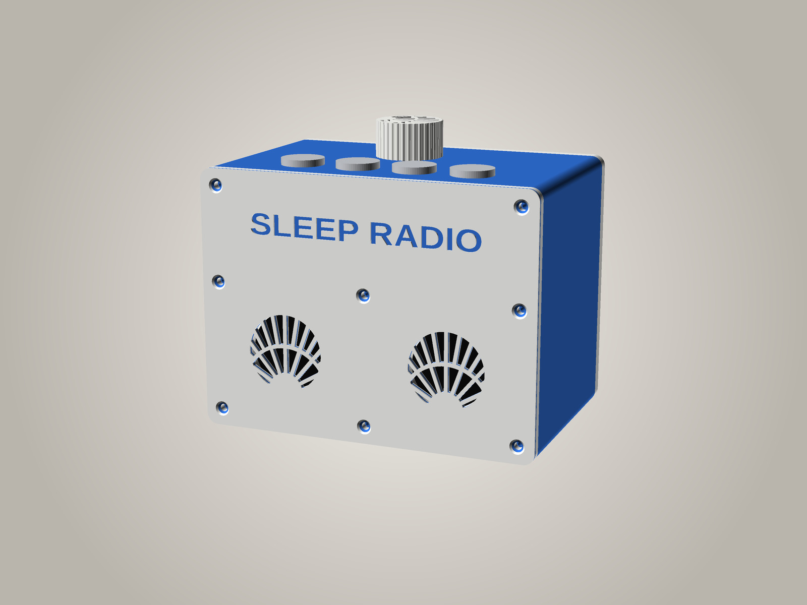
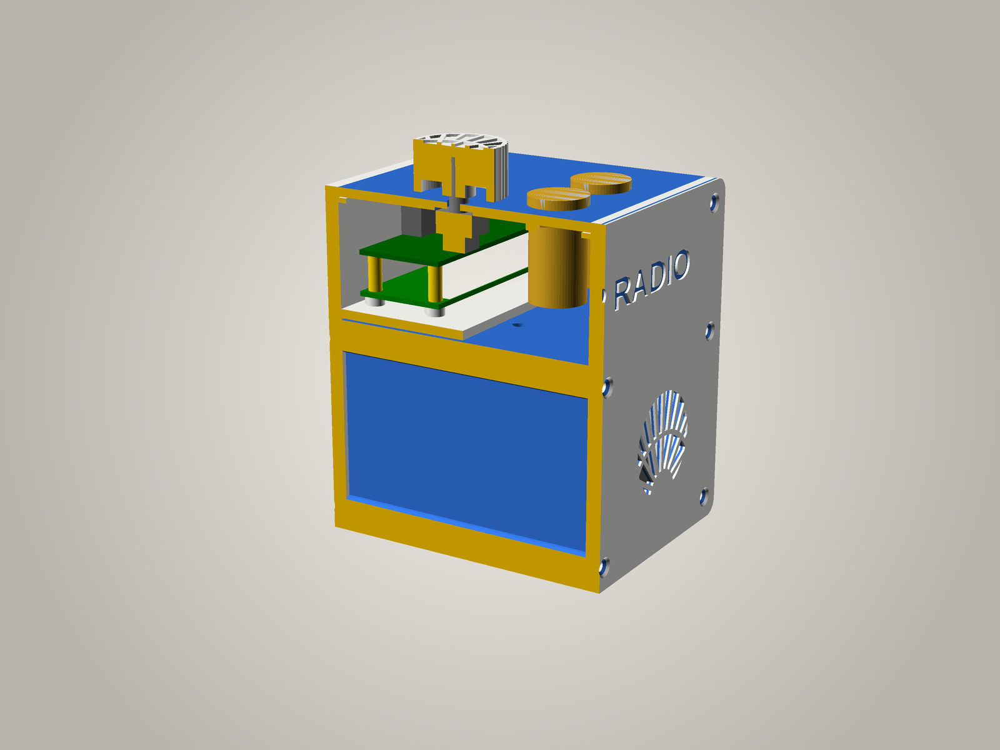

# SleepRadioPi box, version 2 — designed around its speakers



> **Designed, not yet printed.** The geometry is checked in OpenSCAD (no parts
> clash; the electronics tray slides out), but nothing has been printed or
> listened to yet. [Version 1](../case) is the one being built now.

Same speakers (two **Gikfun EK1794**, 40 mm, 4 Ω), same Pi Zero 2 W + HiFiBerry MiniAmp, RTC, knob and four
preset buttons as [version 1](../case) — but the cabinet is sized from the speakers' acoustics instead of just
fitting the parts, and each speaker has its **own sealed chamber**.

**152 × 100 × 115 mm** (w × d × h; version 1 is 152 × 100 × 91). Each chamber is 71.8 × 90 × 66.6 mm inside:
**0.40 L net**, about **0.46 L** effective with loose wadding.



## Why this shape

A speaker's cabinet should be sized from its **Thiele–Small** figures — its resonance **Fs**, its damping
**Qts** and the "springiness" of its suspension as a volume of air, **Vas**. Gikfun only publish the resonance
(320 Hz ± 20%) and sensitivity (83 dB). The closest fully specified driver of the same kind, Dayton Audio's
38 mm [CE38M](https://www.daytonaudio.com/images/resources/285-129-dayton-audio-ce38m-8-spec-sheet.pdf), measures
Fs 192 Hz, **Qts 1.17**, **Vas 0.33 L**; from the EK1794's 320 Hz, 40 mm cone and a typical moving mass, its
Qts is ~1 and its Vas ~0.1–0.2 L. So the design was checked across **Fs 250–320 Hz, Qts 0.8–1.2 and Vas
0.1–0.3 L**, which also covers the ~250 Hz resonance the [analyser](https://dylan7474.github.io/SleepRadioPi-OS/)
measured in version 1.

With Qts around 1:

- **Sealed, not ported.** Bass-reflex alignments need Qts of roughly 0.2–0.5; with Qts ~1 a port only adds a
  boomy hump. (Version 1's bass-port back panel was a guess in this direction; version 2 drops it.)
- **0.35–0.45 L per speaker is the sweet spot.** A sealed box's bass limit and resonance peak, worst case over
  the whole range above:

  | Chamber (per speaker) | −3 dB point (worst) | resonance peak (worst) |
  |---|---|---|
  | 0.25 L | 342 Hz | 5.1 dB |
  | 0.35 L | 325 Hz | 4.5 dB |
  | **0.45 L** (this box, with wadding) | **316 Hz** | **4.1 dB** |
  | 0.60 L | 308 Hz | 3.7 dB |
  | 1.20 L | 296 Hz | 3.1 dB |

  Below ~0.3 L it gets noticeably worse; above ~0.5 L the gain is inaudible. Version 1's whole box was about
  0.95 L, but shared by both speakers and full of parts, cable slot open.
- **One chamber per speaker**, so they don't push on each other's air, and nothing that passes through the case
  (the buttons, the knob, the power lead) opens into a chamber.
- The small bump at resonance is what the radio's EQ is for; set the **low cut to about 180 Hz** (Speaker EQ on
  the web page): below the box's roll-off, bass boost only makes the cones flap (their travel is ~0.1 mm).

## Layout

- **Electronics bay** across the top (40 mm): the four buttons at the front, the knob behind them, and the Pi +
  MiniAmp lying flat on a **tray** that's part of the back panel, component side up, ports towards the back —
  so the **micro-USB lead plugs straight in through the back panel**. The RTC sits on the tray too, in a low
  rim, on foam tape. Take the back panel off and everything comes out with it.
- **Shelf** (2.4 mm) under the bay, and a **centre wall** below it: both are part of the tube, print upright
  with it (front end down, no supports) and run flush to both ends of the tube.
- **Two chambers** under the shelf, a speaker in the middle of each. The speaker wires go down through one
  4 mm hole per chamber in the shelf.
- **Eight screws per panel**: the four corners, the two ends of the shelf and the two ends of the centre wall,
  so each panel is pulled tight onto the walls it seals against.

## Parts

| Part | Print | Notes |
|---|---|---|
| `tube` | front end down, no supports | walls, shelf, centre wall; button, knob and wire holes |
| `front` | face down | two grilles (sunburst; `-D 'grille_style="hex"'`), **SLEEP RADIO** across the top band (`logo_lines`) |
| `rear` | outside face down | with the electronics tray (it prints as an upright fin) and the power plug hole |
| `knob`, `tabs` | as version 1 | `front_plate` = front + knob + tabs on one bed |

```
openscad --backend=manifold -D 'part="tube"' -o tube.stl sleepradiopi_box_v2.scad
```

`part="check"` should come out empty (touching faces only) and `part="check_pull"` shows nothing in the way of
the tray sliding out. Rendering `part="none"` echoes the size and each chamber's volume; change `chamber_h` to
resize the chambers (the box grows with it).

The two-tone front works as in version 1 (a filament change 0.8 mm up the face print); the lettering is one
line now.

## Assembly notes

- **Seal it.** The chambers only work sealed. Put **1–2 mm self-adhesive foam tape** (3 mm wide) on both end
  faces of the tube — the rim, the shelf and the centre wall — before screwing the panels on; the eight screws
  squeeze it.
- **Speaker wires**: down through the shelf holes; fill each hole round the wire with **hot glue**. Leave some
  slack so the back panel can come out far enough to reach the amp's terminal.
- **Wadding**: a **loose handful of polyester fibre** (cushion stuffing) in each chamber, not packed; it damps
  reflections and makes each chamber act ~15 % bigger. Keep it off the back of the cone.
- **Screws**: 16 × M3 × 12 countersunk self-tappers (the panels), 4 × **M2.5 × 10** from under the tray into the
  Pi's 12 mm standoffs (the kit's M2.5 × 6 are too short now), the clamp tabs' M2.5 × 6 as before.

## Still to check

As version 1: the speakers' rim thickness and depth, the buttons' sizes, and the power lead's plug moulding
(`plug_w`, `plug_h`, 12 × 9 mm) — measure yours with calipers before printing.

## Licence

As the rest of the repository.
