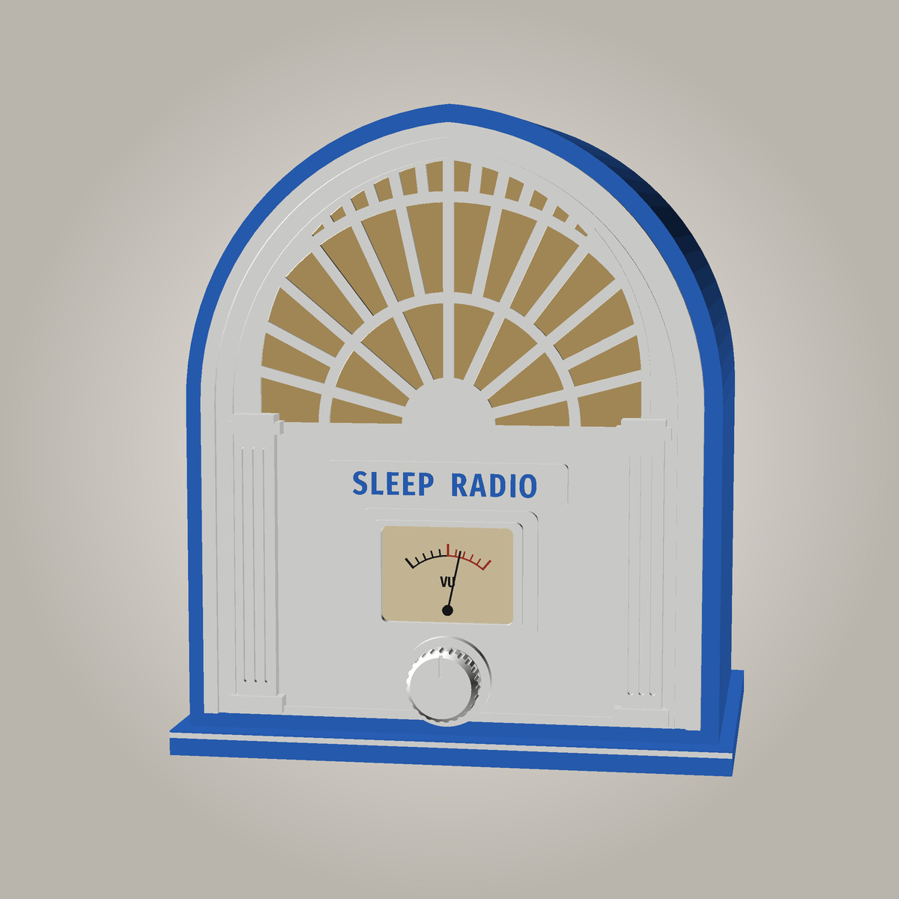

# SleepRadioPi cathedral radio (concept)

The next case for the radio: a **1930s cathedral set, art deco**. So far this
is **a concept picture only**. The printable parts come once the speaker and
the meter are here to measure.

- **About 300 W × 360 H × 200 D mm.**
- **Art deco front:** a sunburst fretwork grille in the arch, over grille
  cloth and **one 4-inch (100 mm) full-range speaker**.
- **The VU meter as the dial window:** a backlit 500 µA panel meter in a
  stepped bezel, driven from the Pi (hardware PWM) with the app's ballistics.
- **One knob** below it; fluted pilasters and a SLEEP RADIO plaque.
- **Multi-part, bolted or clipped together, no glue:**
  - the face in two halves, joined up a centre rib;
  - the arched hood in segments, joined with internal flanges and M3 screws;
  - the plinth;
  - the back panel carrying the Pi, amp and RTC as in the [box](../case/);
  - a clip-in grille-cloth frame;
  - screw-on trim, which can be printed in a second colour.

**All wood, the authentic look:**
- a dark walnut cabinet and mouldings;
- a lighter figured-wood face and fretwork;
- a brass name plaque;
- a brown "Bakelite" knob.

**Filament:** Prusament Woodfill, with real wood particles, sold by Prusa. It prints
on a standard 0.4 mm brass nozzle, needs no drying, and can be sanded and
stained. PrusaSlicer's `Prusament Woodfill` profile works on the MK2.5.
- **Chocolate Brown** for the cabinet, mouldings, plinth and knob.
- **Pastel Brown** or **Linden Light** for the face and fretwork.
- It's more brittle than plain PLA, so the screw bosses and clips will be
  designed thicker.
- It sticks very hard to a PEI bed: use glue stick as a release layer.

(Earlier colour studies: `concept_walnut*.jpg`, a walnut cabinet with a cream
face.)

`concept.scad` is the picture's model (not printable parts), and
`./make-concept.sh` renders the pictures (`WOOD=1` for the all-wood ones, `WALNUT=1` for walnut and cream) (needs OpenSCAD + ImageMagick).
Colours and sizes are variables at the top.
