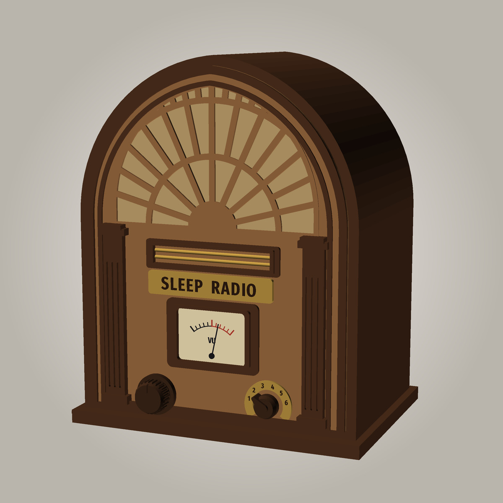
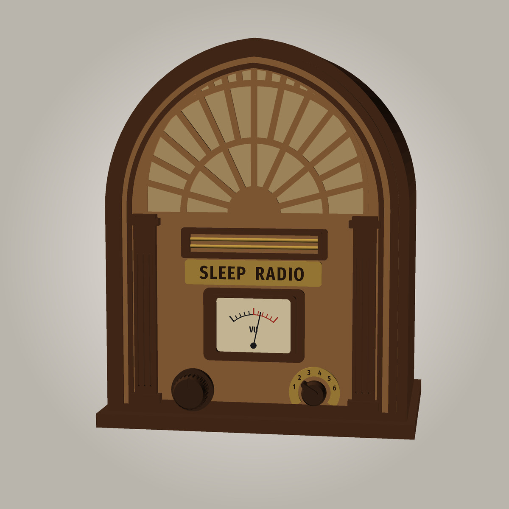
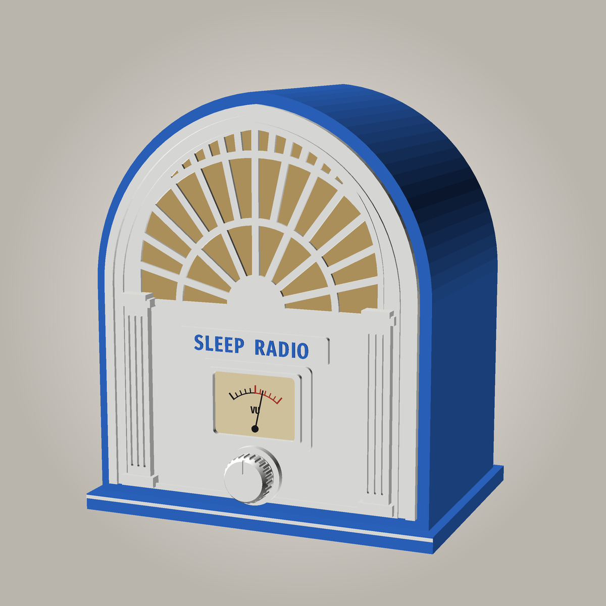
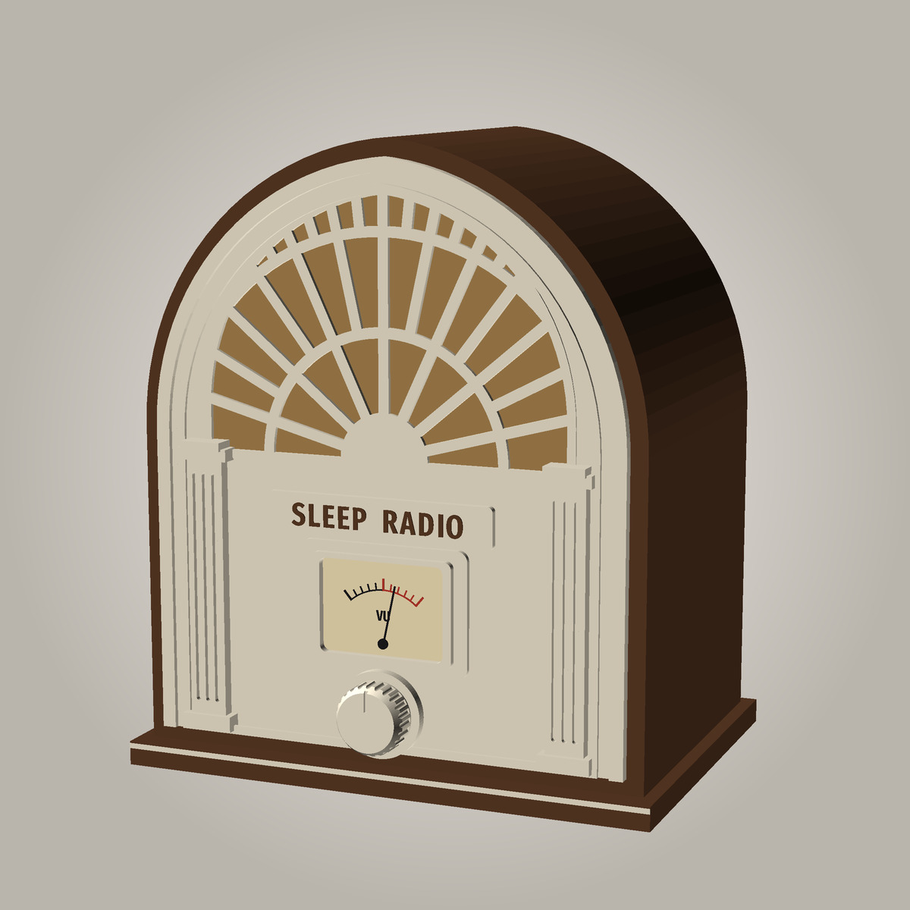

# SleepRadioPi cathedral radio

The next case for the radio is a **1930s cathedral set, very art deco**, in
wood. This page collects the design and the recommended parts.

> **Status: concept.** These are pictures of the design, not printable parts
> yet. The parts will be designed once the speaker and the VU meter arrive and
> can be measured.

## The design

- **About 300 W × 360 H × 200 D mm**, the size of a mid-size 1930s cathedral set.
- **A sunburst fretwork grille** fills the arch: rays fanning from a half-sun,
  with two arcs across, over grille cloth and **one 4-inch full-range speaker**.
- **The VU meter is the dial window.** A backlit analogue needle meter sits in
  a stepped bezel, where the tuning dial was on the originals. The radio drives
  it itself, with the same needle movement as the SleepRadio app's meters.
- **One knob** below the meter, the volume and pause knob (hold it to hear
  the radio's address).
- **Fluted pilasters** either side, a **brass name plaque**, stepped mouldings
  round the arch, and a plinth.
- **All wood:**
  - a dark walnut cabinet and mouldings;
  - a lighter wood face and fretwork;
  - a brown "Bakelite" knob, as the originals had.

### A glow at night (planned)

Warm-white LEDs behind the grille cloth, with the fretwork in silhouette, like
the dial lamps of the originals:
- a 5 V warm-white (about 2700 K) COB LED strip on a printed diffuser ring
  round the speaker, with a wire channel designed in;
- dimmed by the radio (one GPIO pin through a small MOSFET), so it can be set
  from the web page, fade with the sleep timer and come up with the start-up
  chime;
- matched to the VU meter's warm backlight, and dimmed with it.

### How it will go together

Multi-part to fit an ordinary printer bed (designed on a Prusa MK2.5,
250 × 210 mm), and **bolted or clipped together, no glue**:

- the face in two halves, joined up a decorative centre rib;
- the arched hood (top and sides) in segments, joined with internal flanges
  and M3 screws into heat-set inserts, so nothing shows outside;
- the plinth, which the hood and face bolt down onto;
- the back panel, carrying the Pi, amp and RTC as in the [box](../case/). It
  comes off with all the electronics on it;
- a clip-in frame for the grille cloth, so it can be changed;
- trim that screws on from behind: the meter bezel, the plaque and the knob.

## What to buy

| Part | Recommendation | Why |
|---|---|---|
| Speaker | **Visaton FR 10, 4 Ω** (4-inch / 100 mm full range, paper cone), about £15–25 | See [the speaker](#the-speaker) |
| VU meter | **VU panel meter, 500 µA, warm backlight**, usually sold as a pair with a driver board; the **45 mm** size if you can | See [the VU meter](#the-vu-meter) |
| Meter parts | a **5.6 kΩ resistor** and a **2 kΩ trimmer** | Sets the needle's full scale |
| Meter backlight (maybe) | a small **5 V → 12 V boost board** | The backlight is rated 6–12 V; the radio has 5 V |
| Filament | **Prusament Woodfill**: 2 × **Chocolate Brown**, 1 × **Pastel Brown** or **Linden Light** | See [the filament](#the-filament) |
| Nozzle (optional) | a **0.6 mm** E3D V6 nozzle | Less clogging with wood, half the print time on the big parts |
| Grille glow (planned) | a 5 V **warm-white COB LED strip** (about 2700 K), a logic-level N-MOSFET (e.g. AO3400) or a small MOSFET module | Lights the grille cloth from behind |
| Grille cloth | vintage-style speaker grille cloth, gold/tan, about 250 × 250 mm | Sits behind the fretwork |
| Fixings | M3 heat-set inserts and M3 screws (a quantity per part once designed) | Bolt-together, no glue |
| The electronics | the same as the first radio: Pi Zero 2 W, HiFiBerry MiniAmp, knob, optional RTC, and the [GPIO splitter](../../README.md#hardware-and-wiring) | See [Build one](../../README.md#build-one) |

### The speaker

**Visaton FR 10, the 4 Ω version.** The amp is the limit, not the speaker:
the MiniAmp gives about 3 W, so there's no point spending much more than
£15–30.

- **Sensitivity matters more than watts.** The FR 10 makes 86 dB from 1 W, so
  about 91 dB at a metre from the MiniAmp. That's plenty for a room.
- **A proper full-range driver** (80 Hz–20 kHz), so there's no separate tweeter.
- **A paper cone,** for a warm, natural voice that suits a 1930s set and the
  DJ's speech. Cutout 94 mm.
- **Get the 4 Ω version.** The 8 Ω one only gets about half the amp's power.
  The FR 10 HM (whizzer cone, made for cars and boats) isn't needed.
- **Alternative:** the Dayton Audio PC105-4 (poly cone, a crisper sound).
- **Avoid** the unbranded £6–10 "20 W / 40 W full range" speakers. They rarely
  state a sensitivity, and the quality varies.

With one speaker the radio runs in **mono** (Settings → Sound), on one of the
MiniAmp's two channels. The cabinet has room for a bass port, like the
[box's](../case/README.md#bass-port).

### The VU meter

A **moving-coil panel meter with a VU scale, 500 µA full scale (about
650 Ω), with a warm backlight**. On Amazon, search for "VU panel meter 500uA
warm backlight". They usually come **in pairs**, which leaves one for a stereo
pair later.

- **Size:** get the **45 mm** version if you can. It makes a better dial window
  than the ~35 mm one.
- **The driver board in the kit isn't used.** It needs 12 V and a line-level
  audio feed. The radio drives the needle from a hardware PWM pin (GPIO12,
  header pin 32) through the resistor and trimmer. The level comes from the
  radio's own audio, before the volume control, so the needle moves even
  when the radio is turned down, like the app's meters.
- **Backlight:** it's rated 6–12 V, so it may be dim at 5 V. A tiny 5 V to
  12 V boost board fixes that.

### The filament

**All wood, for authenticity.** A white front, like the first radio's, would
look wrong on a cathedral set.

**Prusament Woodfill** (£34.90 per kg from Prusa; also sold on Amazon, so search there for "Prusament Woodfill") is the pick:

- **Real wood particles.** It looks, feels and smells like wood, and it can be
  sanded and stained.
- **It prints on a standard 0.4 mm brass nozzle** (unusual for wood filament),
  and needs no drying.
- **Ready in PrusaSlicer:** the `Prusament Woodfill` profile works on the
  MK2.5 at 0.4 mm.
- **Colours:** **Chocolate Brown** for the cabinet, mouldings, plinth and knob;
  **Pastel Brown** or **Linden Light** for the face and fretwork.
- **Care points:**
  - It's more brittle than plain PLA, so the screw bosses and clips are
    designed thicker.
  - It sticks very hard to a PEI bed: use glue stick as a release layer.
- **Quantity:** about 1–1.5 kg of the dark and under 1 kg of the light, so
  two spools of the dark and one of the light.

**If you can't get it:** **SUNLU Wood PLA** in **Walnut** (dark) and **Wood**
(light), or ELEGOO Walnut Wood PLA. They're cheaper, with about 15% real wood
fibre. Start from a PLA profile at 205–210 °C, print a test piece first, and
a 0.6 mm nozzle helps. Avoid "wood colour" PLAs such as Polymaker PolyTerra
Wood Brown: they're a wood-coloured matte PLA with no wood in them, so they
won't take a stain.

**Finishing:**
- Sand lightly, 240 then 400 grit.
- Wipe on a walnut stain or Danish oil, then a satin varnish.
- Print the plaque in a gold or silk-gold PLA, or cut it from brass sheet.

## Other colourways

Earlier studies, also in this folder:

| Blue and white, like the first radio | Walnut cabinet, cream face |
|---|---|
|  |  |

## The files

- `concept.scad`: the model behind the pictures (not printable parts). Colours
  and sizes are variables at the top.
- `./make-night.sh`: renders the night picture (`concept_night.jpg`), the
  wood radio with its lamps on. OpenSCAD has no lights, so it renders the
  lit parts as a mask and adds the glow with ImageMagick.
- `./make-concept.sh`: renders the pictures. Add `WOOD=1` for the wood ones or
  `WALNUT=1` for walnut and cream. Needs OpenSCAD and ImageMagick.
